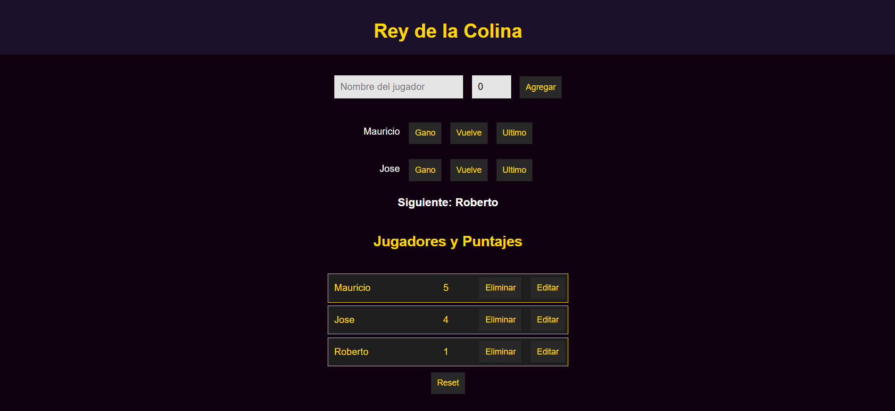

# 👋 ¡Hola! Soy Mauricio Belforte

💻 Desarrollador web Front-End , y estoy capacitandome para tener un perfil completo Full-Stack. Me encanta combinar diseño con código y estoy siempre aprendiendo nuevas herramientas para llevar la experiencia web al siguiente nivel.

- 🎨 [Mi Portfolio](https://mauriciobelforte.github.io/mi-portfolio/)

---

## 🚀 Proyectos destacados

<table>
  <tr>
    <td align="center">
      <a href="https://toscanes.com.ar/" target="_blank">
         
        <strong>Toscanes</strong>
      </a>
      
Landing page para grupo inmobiliario con menú desplegable.

      <a href="#">🔗 Ver código</a>
    </td>
    <td align="center">
      <a href="https://mauriciobelforte.github.io/radio-Santa-Barbara/" target="_blank">
         
        <strong>Radio Santa Barbara</strong>
      </a>
      
Audio en vivo, galería rotativa y animaciones.

      <a href="https://github.com/MauricioBelforte/radio-Santa-Barbara" target="_blank">🔗 Ver código</a>
    </td>
    <td align="center">
      <a href="https://mauriciobelforte.github.io/Proyecto-CaC-Nodejs/" target="_blank">
         
        <strong>TREX E-commerce</strong>
      </a>
      
Proyecto de tienda online con Bootstrap.

      <a href="https://github.com/MauricioBelforte/Proyecto-CaC-Nodejs" target="_blank">🔗 Ver código</a>
    </td>
  </tr>
  <tr>
    <td align="center">
      <a href="https://mauriciobelforte.github.io/proyecto-marcador-gana-sigue/" target="_blank">
         
        <strong>Colimbeta</strong>
      </a>
      
Marcador de partidas con lógica de turnos y puntajes.

      <a href="https://github.com/MauricioBelforte/proyecto-marcador-gana-sigue" target="_blank">🔗 Ver código</a>
    </td>
    <td align="center">
      <a href="https://empleoonlinecripto.web.app/" target="_blank">
         
        <strong>Web Personal</strong>
      </a>
      
Diseño de cards responsivas para presentación personal.

      <a href="#">🔗 Ver código</a>
    </td>
    <td align="center">
      <a href="https://mauriciobelforte.github.io/InmersionDev-Generador-de-contrasenas-Clase1/" target="_blank">
         
        <strong>Generador de contraseñas</strong>
      </a>
      
App JS para generar contraseñas seguras con validación.

      <a href="https://github.com/MauricioBelforte/InmersionDev-Generador-de-contrasenas-Clase1/tree/main" target="_blank">🔗 Ver código</a>
    </td>
  </tr>
</table>
## 🛠️ Tecnologías y herramientas

---

## 📈 GitHub Stats

---

## 📫 Contacto

---

